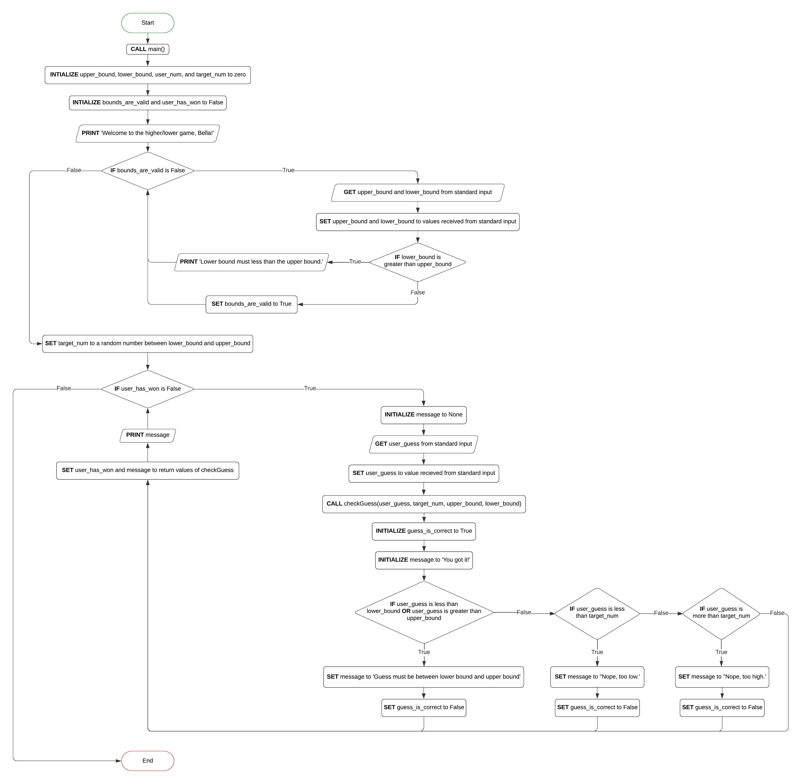

# Problem statement

Your friend Maria has come to you and said that she has been playing the higher/lower 
game with her three-year-old daughter Bella. Maria tells Bella that she is thinking of 
a number between 1 and 10, and then Bella tries to guess the number. 
When Bella guesses a number, Maria tells her whether the number she is thinking of is 
higher or lower or if Bella guessed it. The game continues until Bella guesses the right number. 
As much as Maria likes playing the game with Bella, Bella is very excited to play the game all the time. 
Maria thought it would be great if you could create a program that allows Bella to play the game as much as she wants.

## Pseusdocode

```
function checkGuess(user_guess, target_num, upper_bound, lower_bound):
    INITIALIZE guess_is_correct to True
    INITIALIZE message to 'You got it!'
    IF user_guess < lower_bound OR user_guess > upper_bound:
        SET message to 'Guess must be between lower bound and upper bound'
        SET guess_is_correct to FALSE
    ELSE IF user_guess < target_num:
        SET message to 'Nope, too low.'
        SET guess_is_correct to FALSE
    ELSE IF user_guess > target_num:
        SET message to 'Nope, too high.'
        SET guess_is_correct to FALSE
    END IF
    RETURN a tuple with guess_is_correct and message

function main():
    INITIALIZE upper_bound, lower_bound, user_guess, and target_num to zero
    INITIALIZE bounds_are_valid and user_has_won to False
    PRINT 'Welcome to the higher/lower game, Bella!'
    WHILE bounds_are_valid is False:
        GET lower_bound and upper_bound from standard input
        SET lower_bound and upper_bound to values received from standard input
        IF lower_bound is greater than upper_bound THEN:
            PRINT 'The lower bound must less than the upper bound.'
        ELSE:
            SET bounds_are_valid to True
        END IF
    END WHILE
    SET target_num to a random number between lower_bound and upper_bound
    WHILE user_has_won is False:
        INITIALIZE message to None
        GET user_guess from standard input
        SET user_guess to value received from standard input
        CALL checkGuess(user_guess, target_num, upper_bound, lower_bound)
        SET user_has_won and message to return value of checkGuess
        PRINT message
    END WHILE

CALL main()
```

## Program Flowchart

